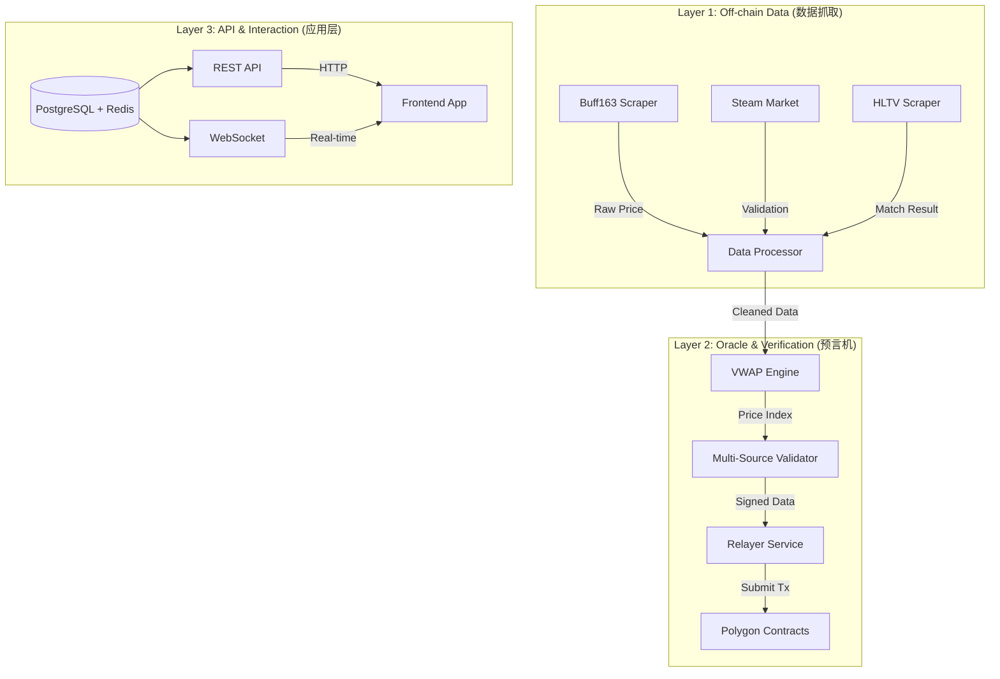

# PolyStrike Backend & Oracle System Architecture

> **Version**: 1.0.0
> **Role**: "The Truth Machine" - Connecting Web2 Data to Web3 Smart Contracts
> **Tech Stack**: Node.js (TypeScript), Express, Ethers.js, PostgreSQL, Redis

## 1. Executive Summary (项目愿景)

PolyStrike 后端系统的核心职责是**数据解码**与**链上验证**。它作为 Web2 现实世界与 Web3 智能合约之间的桥梁，负责抓取真实市场的饰品价格和电竞赛事结果，经过清洗、验证（防作恶）后，通过 Oracle 机制写入 Polygon 链上合约。

---

## 2. System Architecture (系统架构)



---

## 3. Project Structure (项目结构)

后端采用模块化分层架构，清晰分离抓取、验证和接口逻辑。

```text
backend/
├── src/
│   ├── scrapers/          # 数据抓取层
│   │   ├── buff163.ts     # Buff163 核心爬虫
│   │   ├── steam.ts       # Steam 辅助验证爬虫
│   │   └── hltv.ts        # HLTV 赛事结果爬虫
│   ├── oracle/            # 预言机核心层
│   │   ├── vwap.ts        # 加权平均价计算算法
│   │   ├── validator.ts   # 多源防作恶验证器
│   │   └── relayer.ts     # 链上交易发送服务
│   ├── api/               # 接口服务层
│   │   ├── server.ts      # Express App 入口
│   │   ├── routes/        # API 路由定义
│   │   └── websocket.ts   # 实时数据推送
│   ├── database/          # 数据持久层
│   │   └── models/        # Prisma/TypeORM 模型
│   └── config/            # 环境配置 (Env, Constants)
└── package.json
```

---

## 4. Technical Components (核心组件实现)

### 4.1 Data Scraper Layer (数据抓取)

负责从外部源获取原始数据并标准化。

*   **Buff163 Scraper (`buff163.ts`)**
    *   **目标**: 获取 CS2 饰品实时买卖单价格。
    *   **逻辑**: 轮询关注列表中的 `goods_ids`，提取 `sell_min_price` 和成交记录。
    *   **异常处理**: 过滤掉偏离均值 > 50% 的“钓鱼价格”。

*   **Steam Market Scraper (`steam.ts`)**
    *   **目标**: 作为辅助验证源 (Sanity Check)。
    *   **逻辑**: 当 Buff 价格波动剧烈时，调用 Steam API 确认涨跌趋势是否一致，防止单一数据源被操纵。

*   **HLTV Scraper (`hltv.ts`)**
    *   **目标**: 结算 P2P 赛事对赌。
    *   **逻辑**: 监听比赛状态 `Scheduled` -> `Live` -> `Finished`。抓取最终比分 (Score) 和获胜方 (Winner)。

### 4.2 Oracle Service (预言机服务)

负责数据的计算、验证与上链。

*   **VWAP Engine (`vwap.ts`)**
    *   **算法**: Volume Weighted Average Price (成交量加权平均价)。
    *   **公式**: `Sum(Price * Volume) / Sum(Volume)` (基于过去 1 小时窗口)。
    *   **目的**: 消除瞬时插针价格的影响，反映真实市场深度。

*   **Multi-Source Validator (`validator.ts`)**
    *   **防作恶核心**:
        1.  **双源比对**: `Wait |Diff(Buff - Steam)| < 5%`。
        2.  **挑战期**: 数据生成后在本地缓存 2 分钟，无异常报警后再签名。
        3.  **熔断机制**: 若短时暴涨暴跌超过阈值，暂停自动上链，转为人工并在 Twitter 发出警报。

*   **Relayer (`relayer.ts`)**
    *   使用 Ethers.js 管理 Oracle 私钥。
    *   调用合约 `OracleAdapter.updatePrice(skinId, price, signature)`。
    *   调用合约 `BettingRouter.resolveMatch(matchId, winner)`。

### 4.3 Database Schema (数据库设计)

使用 PostgreSQL 存储历史数据，Redis 处理实时缓存。

```sql
-- 1. 饰品元数据表
CREATE TABLE skins (
    id VARCHAR(64) PRIMARY KEY,     -- e.g., "AK47-Redline-FT"
    market_hash_name VARCHAR(255),  -- Steam 标准名称
    buff_goods_id INTEGER,          -- Buff 商品 ID
    icon_url TEXT
);

-- 2. 价格历史表 (K线数据源)
CREATE TABLE price_history (
    id SERIAL PRIMARY KEY,
    skin_id VARCHAR(64) REFERENCES skins(id),
    price DECIMAL(18, 2) NOT NULL,  -- 记录价格
    volume INTEGER,                 -- 当前成交量/挂单量
    source VARCHAR(32),             -- 'buff163' | 'steam'
    timestamp TIMESTAMP DEFAULT NOW()
);

-- 3. 赛事表 (对赌标的)
CREATE TABLE matches (
    match_id VARCHAR(64) PRIMARY KEY, -- HLTV ID
    team_a VARCHAR(128),
    team_b VARCHAR(128),
    start_time TIMESTAMP,
    status VARCHAR(32),             -- 'SCHEDULED', 'LIVE', 'FINISHED'
    winner VARCHAR(128),            -- 获胜队伍 (结算后写入)
    score VARCHAR(32)               -- e.g., "2:1"
);
```

### 4.4 API Layer (接口定义)

REST API 供前端查询历史数据与状态。

| Method | Endpoint | Description |
|:---|:---|:---|
| `GET` | `/api/skins` | 获取支持对赌的饰品列表 |
| `GET` | `/api/skins/:id/history` | 获取饰品 K 线图数据 (High/Low/Open/Close) |
| `GET` | `/api/markets/live` | 获取当前活跃的预测池 |
| `GET` | `/api/matches` | 获取可下注的赛事列表 |
| `GET` | `/api/oracle/status` | 查看 Oracle 节点健康状态与最后上链时间 |

---

## 5. Verification Plan (验证计划)

在部署前需通过以下验证步骤：

1.  **数据准确性测试**:
    *   对比爬虫抓取的 Buff 价格与网页端显示价格，误差需 < 0.1%。
2.  **VWAP 算法验证**:
    *   使用模拟交易数据流，确认算法能正确平滑异常波动。
3.  **Relayer 冒烟测试**:
    *   在 Polygon Mumbai 测试网运行 Relayer，确保 `updatePrice` 交易成功上链且 Gas 费用在预算内。
4.  **API 压力测试**:
    *   确保 `/api/skins/:id/history` 在高并发下能快速返回缓存数据。

---

## 6. Development Roadmap (开发路线图)

### Phase 1: Planning (计划阶段)
- [x] **Create implementation plan**: 设计后端架构与技术选型。
- [ ] **User Approval**: 确认技术方案与需求。

### Phase 2: Execution (执行阶段)

#### Project Setup
- [x] **Initialize Project**: 建立 Node.js/TypeScript 项目结构。
- [x] **Dependencies**: 配置 package.json。
- [ ] **Config**: 配置 TypeScript 和 Lint 工具。

#### Data Scrapers (链下数据层)
- [ ] **Buff163 Scraper**: 实现饰品价格抓取核心逻辑。
- [ ] **Steam Scraper**: 实现辅助验证价格源逻辑。
- [ ] **HLTV Scraper**: 实现赛事结果抓取逻辑。
- [ ] **Data Processing**: 实现 VWAP 均价计算与多源验证逻辑。

#### Oracle Service (预言机服务)
- [ ] **Service Architecture**: 搭建 Oracle 服务框架。
- [ ] **Relayer**: 实现价格更新 (`updatePrice`) 上链逻辑。
- [ ] **Match Relayer**: 实现赛事结果 (`resolveMatch`) 上链逻辑。
- [ ] **Security**: 添加签名验证与白名单机制。
- [ ] **Challenge Mechanism**: 实现 2 分钟防作恶缓冲期逻辑。

#### API Layer (接口层)
- [ ] **Server Setup**: 搭建 Express/Fastify 服务器。
- [ ] **REST API**: 开发前端所需的查询接口。
- [ ] **Real-time**: 实现 WebSocket 价格推送。
- [ ] **Robustness**: 添加限流与全局错误处理。

#### Database (数据层)
- [ ] **Schema Setup**: 初始化 PostgreSQL 和 Redis。
- [ ] **Models**: 定义价格与赛事的数据模型。
- [ ] **Caching**: 实现 Redis 缓存层。

### Phase 3: Verification (验证阶段)
- [ ] **Unit Tests**: 编写爬虫与计算逻辑的单元测试。
- [ ] **Integration Tests**: 测试 Oracle 与合约的交互。
- [ ] **API Tests**: 验证接口可用性。
- [ ] **Manual Testing**: 使用真实数据进行端到端测试。
